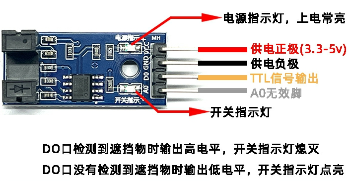
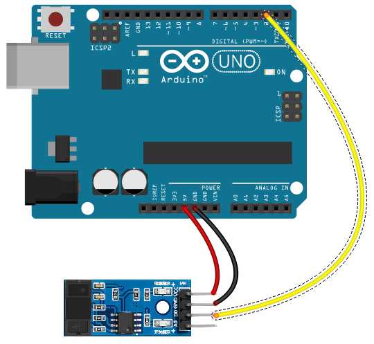

# MD0402对射光电传感器

## 1、介绍 



光电对射传感器由发射端和接收端组成。发射端发出红外光束，接收端接收。当光束被遮挡时，接收端信号发生变化，从而实现检测。核心原理是“光被遮挡 = 有物体通过”。广泛用于电机转速检测，脉冲计数,位置限位等。

## 2、产品参数：

- 工作电压：3.3-5V
- 输出信号：数字信号（有遮挡，输出高电平，无遮挡。输出低电平。）
- 有输出状态指示灯，输出高电平灯灭，输出低电平灯亮。
- 使用进口槽型光耦传感器，槽宽度5mm。
- 比较器输出，信号干净，波形好，驱动能力强，超过15mA。
- 设有固定螺栓孔，方便安装
- 小板PCB尺寸：3.2cmx1.4cm
- 使用宽电压LM393比较器

## 3、接线说明

- VCC 接电源正极 3.3-5V
- GND 接电源负极
- DO TTL 开关信号输出
- AO 此模块不起作用

## 4、Arduino测试

接线：



```c
// 光电对射传感器示例
// 传感器输出：有遮挡=高电平，无遮挡=低电平
const int SENSOR_PIN = 2;   // 传感器信号线接到 D2
const int LED_PIN    = 13;  // 用板载LED指示（遮挡时亮）

void setup() {
  pinMode(SENSOR_PIN, INPUT);      // 传感器为数字输入
  pinMode(LED_PIN, OUTPUT);        // LED输出
  Serial.begin(9600);              // 串口调试，可选
}

void loop() {
  int sensorState = digitalRead(SENSOR_PIN);  // 读取传感器状态

  if (sensorState == HIGH) {
    // 有遮挡：输出高电平
    digitalWrite(LED_PIN, HIGH);   // 点亮LED
    Serial.println("Blocked: HIGH");  // 串口打印
  } else {
    // 无遮挡：输出低电平
    digitalWrite(LED_PIN, LOW);    // 关闭LED
    Serial.println("Unblocked: LOW");
  }

  delay(50); // 简单消抖/限速
}
```

现象：使用Arduino IDE上传代码后，打开串口监视器设置波特率9600，任取一物体放入传感器凹槽，串口监视器输出Blocked的提示，板载LED亮起，将物体从凹槽取出，串口监视器打印Unblocked的提示，板载LED熄灭。（注意：Arduino的环境配置百度即可，这里不予说明）。